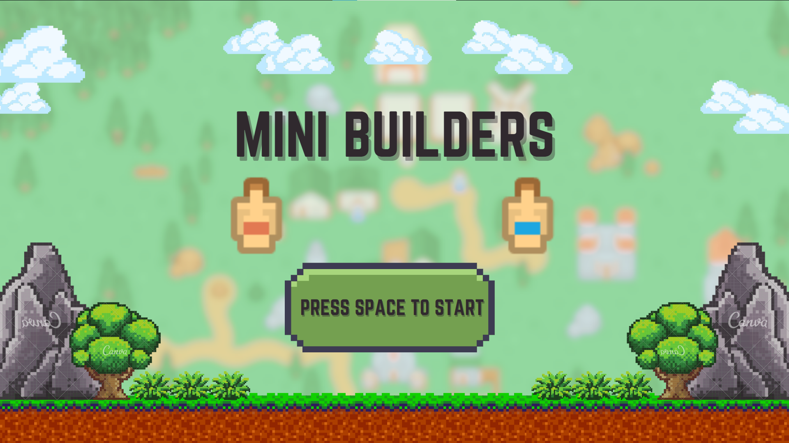
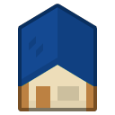
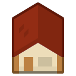
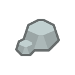

# Mini builders!

## Descripción

Este juego desarrollado en Wollok es un emocionante desafío para dos jugadores, donde la creatividad y la destreza son clave. La premisa del juego gira en torno a la construcción de casas mediante la recolección estratégica de maderas y piedras.

## Equipo de Desarrollo

Este emocionante juego ha sido creado por un talentoso equipo de estudiantes de la UTN Facultad Regional Delta como parte de su cursada en Paradigmas de Programación durante el año 2023. Conozcamos a los brillantes desarrolladores detrás de esta experiencia única:

1. **Campos Manuel**
2. **Di Stefano Tiago**
3. **Della Vecchia Priscila**
4. **Agustín Sánchez**

Este equipo ha combinado su pasión por la programación y la creatividad para llevar a cabo este proyecto innovador. ¡Agradecemos su dedicación y esfuerzo en la creación de este juego de construcción en Wollok!

## Reglas del Juego

1. **Objetivo**: Construir la mayor cantidad de casas del color asignado en un tiempo determinado.

2. **Jugadores**: Dos participantes compiten, cada uno representado por un personaje de color rojo o azul.

3. **Recursos**: Los jugadores deben recoger maderas y piedras para construir sus casas. Cada recurso recolectado contribuye a la construcción de una casa del color correspondiente al jugador.

4. **Zonas de Recolección**: Se establecen zonas específicas para recoger maderas y piedras. Los jugadores deben desplazarse estratégicamente para optimizar la recolección.

5. **Construcción**: Los jugadores pueden construir casas en cualquier momento durante el juego. La cantidad de recursos acumulados determina cuántas casas pueden construir.

6. **Tiempo Límite**: El juego tiene un límite de tiempo predefinido. Al finalizar el tiempo, el jugador que haya construido más casas es declarado ganador.

## Instrucciones de Ejecución

1. **Instalación de Wollok**: Asegúrate de tener Wollok instalado en tu sistema.

2. **Descarga del Juego**: Clona o descarga el repositorio del juego.

3. **Ejecución**: Abre el archivo principal en Wollok y ejecuta el juego.

## Personalización

- **Duración del Juego**: Modifica la variable de tiempo en el código para ajustar la duración de la partida.

- **Mapa del Juego**: Personaliza las zonas de recolección y la disposición del terreno según tus preferencias.

¡Disfruta del juego y que gane el mejor constructor!